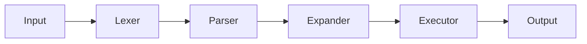

#  Minishell

<div align="center">

**Un shell Unix minimaliste implémenté en C**

[](https://42.fr)
[](<https://en.wikipedia.org/wiki/C_(programming_language)>)
[](https://github.com/42School/norminette)

_Reproduire le comportement de Bash avec les fonctionnalités essentielles d'un shell Unix_

</div>

---

##  Table des Matières

- [ À Propos du Projet](#-à-propos-du-projet)
- [Fonctionnalités](#-fonctionnalités)
- [Architecture](#️-architecture)
- [Installation](#️-installation)
- [Utilisation](#-utilisation)
- [Tests](#-tests)
- [Contraintes Techniques](#-contraintes-techniques)
- [Contribution](#-contribution)
- [Licence](#-licence)

---

## À Propos du Projet

**Minishell** est une implémentation simplifiée d'un interpréteur de commandes Unix, développée dans le cadre du cursus de l'École 42. Ce projet reproduit les fonctionnalités essentielles de Bash, permettant d'exécuter des commandes, gérer les pipes, les redirections et les variables d'environnement.

### Objectifs Pédagogiques

- Comprendre le fonctionnement interne d'un shell Unix
- Maîtriser la gestion des processus (`fork`, `execve`, `wait`)
- Apprendre la communication inter-processus (pipes)
- Gérer les signaux système
- Implémenter un analyseur lexical et syntaxique

---

## Fonctionnalités

### Interface Utilisateur

-  **Prompt interactif** avec affichage personnalisé
-  **Historique des commandes** fonctionnel
-  **Gestion des signaux** : `Ctrl+C`, `Ctrl+D`, `Ctrl+\`

###  Exécution de Commandes

- **Recherche d'exécutables** via `PATH` ou chemins absolus/relatifs
- **Variables d'environnement** : expansion `$VAR` et `$?`
- **Gestion des quotes** : simples `'` et doubles `"`

###  Pipes et Redirections

- **Pipes** : `cmd1 | cmd2 | cmd3`
- **Redirections d'entrée** : `cmd < fichier`
- **Redirections de sortie** : `cmd > fichier`
- **Mode append** : `cmd >> fichier`
- **Heredoc** : `cmd << delimiteur`

### Commandes Intégrées (Builtins)

- `echo` avec option `-n`
- `cd` avec chemins relatifs/absolus
- `pwd` sans options
- `export` sans options
- `unset` sans options
- `env` sans options
- `exit` sans options

---

##  Architecture

Le projet suit une **architecture modulaire** avec séparation claire des responsabilités :

```
src/
├── lexer/          # Analyse lexicale (tokenisation)
├── parser/         # Analyse syntaxique (AST)
├── expander/       # Expansion des variables
├── executor/       # Exécution des commandes
├── builtins/       # Commandes intégrées
├── environment/    # Variables d'environnement
├── signals/        # Gestion des signaux
└── utils/          # Fonctions utilitaires
```

### Pipeline d'Exécution



### Avantages de cette Architecture

- **Séparation des responsabilités** : Chaque module a un rôle précis
- **Modularité** : Tests indépendants et développement parallèle
- **Maintenabilité** : Code structuré et extensible
- **Respect des contraintes** : Une seule variable globale autorisée

---

## Installation

### Prérequis

- **GCC** ou **Clang**
- **Make**
- **Readline library** (`sudo apt-get install libreadline-dev` sur Ubuntu/Debian)

### Compilation

```bash
# Cloner le repository
git clone https://github.com/votre-username/minishell.git
cd minishell

# Compiler le projet
make

# Nettoyer les fichiers objets
make clean

# Nettoyage complet
make fclean

# Recompiler entièrement
make re
```

---

## Utilisation

### Lancement du Shell

```bash
./minishell
```

### Exemples d'Utilisation

```bash
# Commandes simples
minishell$ echo "Hello World"
minishell$ ls -la
minishell$ pwd

# Pipes
minishell$ ls | grep ".c" | wc -l
minishell$ cat fichier.txt | sort | uniq

# Redirections
minishell$ echo "test" > output.txt
minishell$ cat < input.txt
minishell$ ls >> log.txt

# Variables d'environnement
minishell$ echo $HOME
minishell$ export MY_VAR=value
minishell$ echo $MY_VAR

# Heredoc
minishell$ cat << EOF
> Ligne 1
> Ligne 2
> EOF

# Builtins
minishell$ cd /tmp
minishell$ pwd
minishell$ export
minishell$ exit
```

---

## Tests

### Tests Manuels

```bash
# Test des commandes de base
echo "test"
ls | wc -l
echo $HOME

# Test des erreurs
command_inexistante
cat fichier_inexistant

# Test des signaux
sleep 10  # Puis Ctrl+C
```

### Comparaison avec Bash

```bash
# Utiliser bash --posix pour comparer les comportements
bash --posix -c "votre_commande"
```

---

## Contraintes Techniques

### Fonctions Autorisées

```c
readline, rl_clear_history, rl_on_new_line, rl_replace_line, rl_redisplay, add_history,
printf, malloc, free, write, access, open, read, close,
fork, wait, waitpid, wait3, wait4, signal, sigaction,
sigemptyset, sigaddset, kill, exit, getcwd, chdir,
stat, lstat, fstat, unlink, execve, dup, dup2, pipe,
opendir, readdir, closedir, strerror, perror, isatty,
ttyname, ttyslot, ioctl, getenv, tcsetattr, tcgetattr,
tgetent, tgetflag, tgetnum, tgetstr, tgoto, tputs
```

### Norme 42

- **Norminette** : Respect strict des règles de codage
- **Gestion mémoire** : Aucune fuite mémoire (sauf readline)
- **Variable globale unique** : Une seule variable globale pour les signaux
- **Fonctions limitées** : Maximum 25 lignes par fonction

### Limitations

- Pas d'interprétation des quotes non fermées
- Pas de gestion des caractères spéciaux `\` et `;`
- Pas d'expansion des wildcards `*`

---

## Contribution

Ce projet a été développé en binôme dans le cadre du cursus 42. Les contributions externes ne sont pas acceptées, mais n'hésitez pas à :

- **Signaler des bugs** via les issues
- **Suggérer des améliorations** de documentation
- **Mettre une étoile** si le projet vous plaît !

---

## Licence

Ce projet est développé dans le cadre pédagogique de l'École 42. Utilisation libre pour l'apprentissage.

---

<div align="center">

**Fait avec rage par famasito et mimo • École 42**

[⬆ Retour en haut](#-minishell)

</div>
